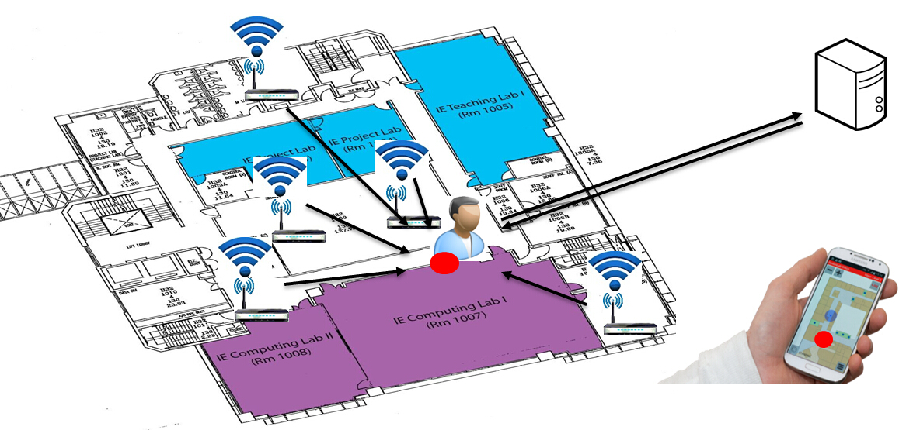
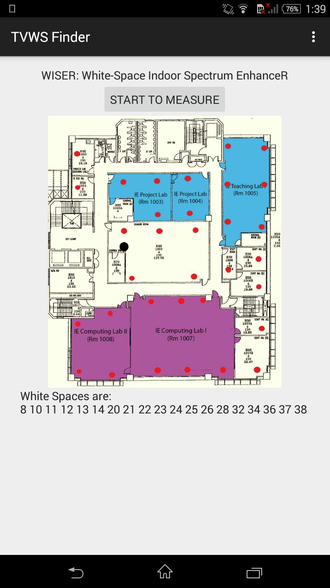



## Introduction

Indoor positioning becomes more and more popular in recent years due to widely applications, such as indoor navigation and
business promotion. In general, there are following four methods to do indoor positioning:

* Trilateration
* Triangulation
* Scene Analysis
* Proximity

## Methods
Among these four methods, scene analysis does not rely on extra hardware. We can use the ubiquitous Wi-Fi Acess Points (AP) 
deployed in buildings to build our indoor positioning system. In this project, we use AP RSS-based scene analysis method. This
method consists of the following two stages:

* offline stage: We select many locations in the building. And for each location, we measure the signal strengths of different APs and
  send the measured data to server database. We call the signal strengths measured at one location as the fingerprint for this location.
* online stage: For the location we want to know, we measure the fingerprint at this location, and compare this fingerprint with the records
  in the database. We use weighted KNN to determine user location.

The figure below shows a high-level idea of our indoor positioning system.

## Implementation

We develop three android apps for our indoor positioning system. 

* The first app is used to scan the Wi-Fi APs in the building and show the corresponding information of APs with stronger signals strength. We use 
  this app to determine the referenced APs.
* The second app is used for fingerprints collection. We use this app to measure the fingerprints at different locations and send the data to 
  server database. 
* The third app is our indoor positioning app. The user can know its own location by clicking a button "START TO MEASURE".

The figure blow is a snapshot of our indoor positioning app. The red points are the measured locations at the offline stage. The black point is estimated user location. Our system is very accuate, the average positioning error is less than 0.5 meters. 

