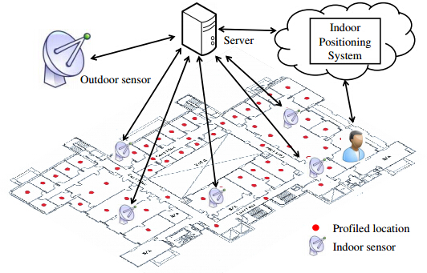



## Introduction

With the rapid growth of mobile devices and applications, the wireless data demand is increasing skyrocketly. To satisfy the data demand,
we need more wireless spectrum. However, most spectrum have been licensed (such as TV, satellite, RADAR, etc.) but significantly under-utilized. Thus one way to satisfy the skyrocketing wireless data demand is to allow unlicensed users to access the licensed spectrum when the spectrum is not in use. Such technique is called Dynamic Spectrum Access (or DSA for short).

A recent trend in DSA is to explore the locally unused TV channels for unlicensed use. The unused TV channels are called TV white spaces or simply 
white spaces. Previous approaches for TV white space identifcation are spectrum sensing and geo-location database. However, spectrum sensing is too expensive and geo-location database uses signal propagation modeling to determine white spaces, which is too conservative and does not work in indoors. 

In this project, we design an innovative system called WISER to identify the indoor white spaces. We deploy over 30 sensors in one floor of a typical office building and store the data in the server database. Users can use our web query interface to query the white space information.

## System Building
The figure below is the architecture of our sytem. The sensors sense the TV spectrum and report the TV channel power to the server database. Users can query the white space information at their locations with the help of indoor positioning. The detailed implementation of indoor positioning can be found via this url: <a href=http://jincheng9.github.io/project/indoor_positioning.html> http://jincheng9.github.io/project/indoor_positioning.html</a>.

## Web Query Interface
